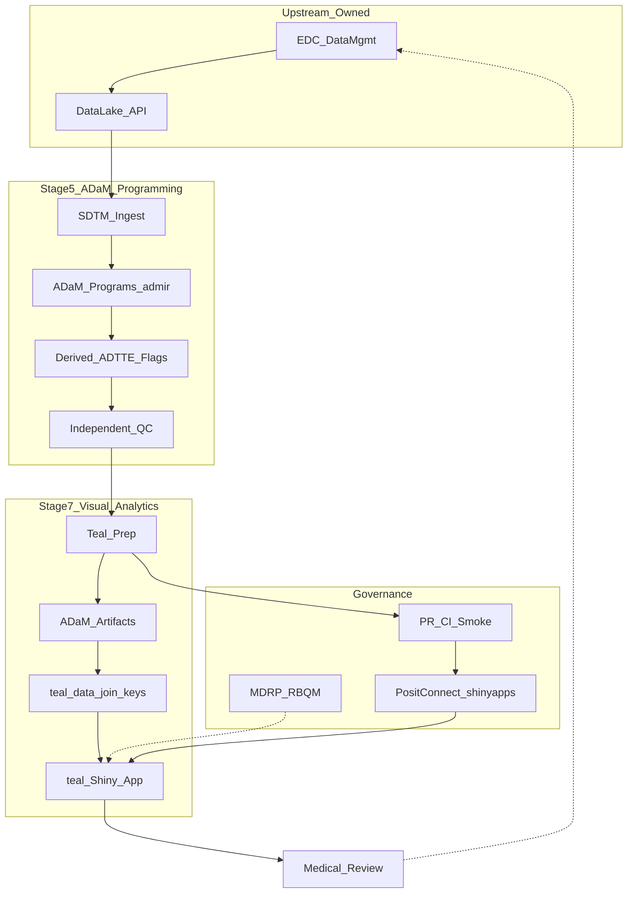
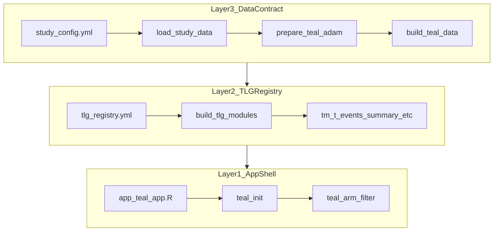
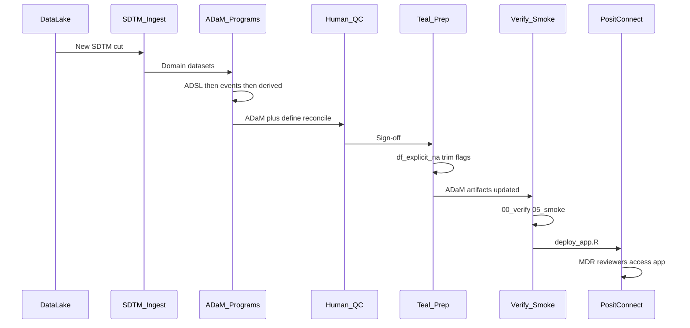
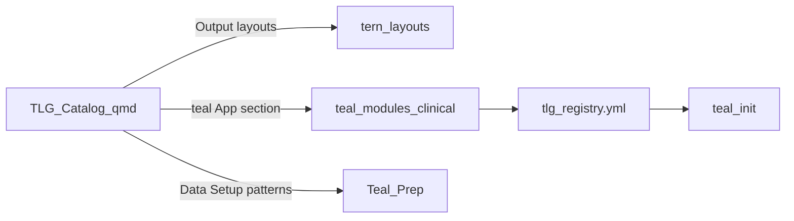
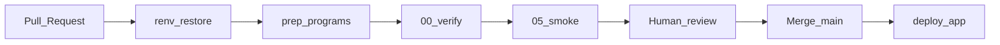

# Ideal Architecture Guide: MDR Teal Dashboard

**CDISCPILOT01 reference — Roche / Genentech NEST stack**

| | |
|---|---|
| **Purpose** | Structural reference for building and maintaining a Medical Data Review (MDR) dashboard on validated ADaM using `teal`, `teal.modules.clinical`, and the [TLG Catalog](https://github.com/insightsengineering/tlg-catalog). |
| **Audience** | Real-time Visual Analytics specialists, statistical programmers, and interview portfolio reviewers. |
| **Scope** | App template architecture, data contracts, cut refresh, verification gates, and deployment — from SDTM delivery through live Shiny. Excludes EDC/DM (Stages 1–3) and submission packaging. |

---

## 1. Purpose and audience

This document answers **how to structure** an MDR teal application so it survives multiple data cuts without rewriting the app. It complements:

- [pipeline_overview.md](pipeline_overview.md) — business narrative of Stages 1–8
- [best_practices.md](best_practices.md) — operational patterns from the TLG Catalog (when available)
- [methods_cheatsheet.md](methods_cheatsheet.md) — RBQM, CDISC, and MDR terminology

**Who this is for:** practitioners who own **Stage 5 (ADaM programming + QC)** and **Stage 7 (visual analytics / teal app template)** in a Roche/Genentech-style environment where NEST packages (`tern`, `rtables`, `rlistings`, `teal`, `teal.modules.clinical`) are the standard presentation layer.

**What this is not:** a tutorial on admiral syntax, EDC configuration, or eCTD submission. Those live upstream or in separate specs.

---

## 2. Executive summary

The ideal MDR dashboard is an **app template** built once against a fixed **ADaM data contract** defined by the TLG Catalog and your study's Statistical Analysis Plan (SAP). SDTM arrives from a data lake or controlled delivery; you **create or update ADaM**, pass independent QC, run **teal prep** on validated artifacts, and refresh the hosted app by swapping config-driven paths — not by editing Shiny module code.

Six principles govern every design decision:

| Principle | Meaning |
|-----------|---------|
| **Catalog-first** | TLG Catalog + `teal.modules.clinical` define the ADaM data contract and `tm_*` module wiring; the app is a thin shell. |
| **ADaM-only at the app boundary** | Shiny/teal never reads SDTM; Stage 5 ends before Stage 7 begins. |
| **App template vs data cut** | Build the interactive shell once; swap validated ADaM artifacts via config on each cut. |
| **Config as contract** | Study metadata, dataset paths, keys, and TLG registry live in YAML — not hard-coded in `app.R`. |
| **Verify before expose** | Automated verify + smoke on every cut; human QC sign-off before production refresh. |
| **Traceability** | Every dashboard refresh maps to SDTM cut ID, ADaM version, prep run, and deploy manifest. |

### Figure 1 — System context



**Your role** (highlighted): Stage 5 ADaM programming + Stage 7 app template + cut-refresh orchestration. You do not own EDC/DM (Stages 1–3) or regulatory submission packaging.

---

## 3. Pipeline position

The dashboard sits at the **downstream end** of the clinical data pipeline:

| Stage | Name | Dashboard involvement |
|-------|------|----------------------|
| 1–3 | Collection / raw / data management | None — upstream |
| 4 | SDTM | Input to your ADaM programs; **not read by the app** |
| 5 | ADaM + QC | **You program, validate, and sign off** |
| 6 | RBQM / MDRP | Defines **which TLGs** the app must expose (scope) |
| 7 | Visual analytics | **App template** — teal modules, filters, deploy |
| 8 | Medical review | Consumers of the live app; feedback loops to DM |

For the full eight-stage narrative, see [pipeline_overview.md](pipeline_overview.md).

**Interview framing:** "My work spans validated ADaM through the interactive MDR layer. I receive SDTM cuts, build or refresh ADaM with independent QC, then maintain a config-driven teal app that medical reviewers use during ongoing safety review."

---

## 4. Three-layer application architecture

The ideal app is **not** one monolithic Shiny file. It separates concerns into three layers with strict boundaries.

### Figure 2 — Layer model



### Layer responsibilities

| Layer | Owns | Must NOT |
|-------|------|----------|
| **1 — App shell** | `teal::init()`, global theme, arm/population filters, deploy entrypoint | Domain derivations, SDTM I/O, per-TLG layout logic |
| **2 — TLG registry** | TLG code → `tm_*` mapping, module arguments, enable/disable by MDRP scope | Reading raw files directly; study-specific ADaM programming |
| **3 — Data contract** | Paths, grains, join keys, `df_explicit_na`, column trim, `teal_data()` assembly | Rewriting catalog table layouts in the app |

### Data flow within the app

1. **Layer 3** loads ADaM from paths in `study_config.yml`, applies catalog-aligned prep (`tern::df_explicit_na()`, optional column trim), and builds a `teal_data` object with `join_keys(data) <- default_cdisc_join_keys[...]`.
2. **Layer 2** reads `tlg_registry.yml`, filters to enabled TLGs whose required datasets exist, and constructs `teal.modules.clinical` module objects via `build_tlg_modules()`.
3. **Layer 1** calls `teal::init(data = ..., modules = ..., filter = ...)` and exposes the Shiny UI — typically fewer than 80 lines.

**Rule:** If a change requires editing `app.R` for a routine data cut, the architecture has leaked — that change belongs in config, prep scripts, or the registry.

---

## 5. Ideal repository layout

Production repos may use a monorepo or split `adam-pipeline` vs `teal-app`, but **responsibilities stay the same**.

```
study-repo/
├── config/
│   ├── study_config.yml      # study meta, dataset paths, keys, grains, CTQ tags
│   ├── tlg_registry.yml      # TLG code → tm_* module wiring (MDRP scope)
│   ├── dataset_inventory.yml # which ADaM domains exist for this cut
│   ├── cut_manifest.yml      # cut date, SDTM version, ADaM hash, safety N
│   └── deploy.yml            # hosting target, smoke gate (gitignored secrets)
├── data/
│   ├── sdtm/                 # landing zone per cut (not bundled to Shiny)
│   └── adam/                 # validated ADaM .rds / .sas7bdat per cut
├── programs/
│   ├── ingest/               # fetch SDTM from lake/API
│   ├── adam/                 # admiral SDTM→ADaM per domain
│   ├── derive/               # ADTTE, ADQS, AE flags
│   ├── prep/                 # teal prep (df_explicit_na, trim)
│   ├── verify/               # schema/grain checks vs config
│   └── smoke/                # build_teal_data + module init
├── R/                        # reusable functions only (no one-off scripts)
├── app_teal/                 # thin Shiny entry
├── outputs/                  # optional static TLG exports (tables/listings/figures)
├── renv.lock                 # reproducible NEST stack
├── deploy_app.R              # bundle + smoke + rsconnect
└── .github/workflows/        # PR: restore → prep → verify → smoke
```

### Tutorial repo gaps

This portfolio repo implements Layer 1–3 and local verify/smoke gates but **shortcuts Stage 5** for learning purposes:

| Ideal component | This repo today | Gap |
|-----------------|-----------------|-----|
| `programs/ingest/` | `data/sdtm/.gitkeep` only | No SDTM fetch from lake/API |
| `programs/adam/` | `programs/01_prepare_adam.R` loads **pharmaverseadam** | No admiral SDTM→ADaM pipeline |
| `programs/derive/` | `programs/02_derive_adtte.R` | Partial — ADTTE only |
| `programs/prep/` | `programs/04_prepare_teal_adam.R` | Aligned |
| `programs/verify/` | `programs/00_verify_adam.R` | Aligned |
| `programs/smoke/` | `programs/05_smoke_test_teal.R` | Aligned |
| `config/cut_manifest.yml` | Not present | Add for production traceability |
| `.github/workflows/` | Not present | Add PR CI when team adopts GitHub Actions |

---

## 6. SDTM → ADaM → teal data flow

### Figure 3 — Cut refresh sequence



### ADaM programming order (Stage 5)

Program in dependency order — **ADSL is always first**:

1. **ADSL** ← DM (+ DS for disposition)
2. **ADAE** ← AE; add `TRTEMFL`, MedDRA hierarchy, analysis flags for AET01
3. **ADLB** ← LB; PARAM/PARAMCD, baseline, change, `ANRIND`/`BNRIND` for LBT04
4. **ADVS** ← VS
5. **ADEX** ← EX
6. **ADCM** ← CM; `ONTRTFL` for CMT01A
7. **ADMH** ← MH
8. **Derived** ← ADSL + ADAE (ADTTE), ADSL + QS sources (ADQS), etc.

**Tooling:** [admir](https://github.com/pharmaverse/admir) + study specs; practice SDTM/ADaM from [pharmaversesdtm](https://pharmaverse.github.io/pharmaversesdtm/) and [pharmaverseadam](https://pharmaverse.github.io/pharmaverseadam/).

### Refresh triggers

| Trigger | Action |
|---------|--------|
| New SDTM cut (new subjects, visits) | Re-run domain programs; re-derive flags/ADTTE; QC; prep; deploy |
| SDTM correction (e.g. MedDRA re-code) | Re-build affected domains; reconcile counts vs prior cut |
| New SDTM domain (e.g. EG delivered) | Create ADEG; enable EGT01/EGL01 in registry if in MDRP scope |
| SAP change (new PARAM, new TTE endpoint) | Update derive scripts; extend `study_config.yml` keys |
| MDRP scope change only | Enable/disable TLGs in `tlg_registry.yml` — no ADaM change |
| Config-only path change | Point `study_config.yml` to new artifact folder; verify + smoke |

**Clarification:** Listings (AEL03, CML01, LBL01) are **outputs** that read ADaM. They do not feed back into ADaM. Updates always trace to SDTM cut, ADaM spec change, or MDRP scope change.

---

## 7. Configuration contracts

Configuration files are the **interface** between layers. The app reads YAML; it does not embed study logic.

### 7.1 `study_config.yml` — ADaM data contract

Each dataset entry documents:

- `path` — location of validated ADaM artifact (relative or absolute controlled path)
- `grain` — subject, event, lab_visit, subject_param, etc.
- `key_variables` — columns required for TLG modules and QC
- Population / analysis flags — `SAFFL`, `TRTEMFL`, `ONTRTFL`
- `derived_by` — script reference when not built directly from SDTM (e.g. ADTTE)
- CTQ factor and FDA ST&F section — MDRP traceability

Example pattern (from this repo):

```yaml
datasets:
  ADAE:
    path: data/adam/ADAE.rds
    grain: event
    key_variables: [USUBJID, ARM, AEDECOD, AEBODSYS, TRTEMFL, AESER, ...]
    ctq_factor: Safety reporting accuracy
```

### 7.2 `tlg_registry.yml` — presentation contract

- **TLG code** — catalog identifier (DMT01, AET01, LBT04, …)
- **`teal_fn`** — `teal.modules.clinical` function (`tm_t_events_summary`, `tm_t_abnormality`, …)
- **`required_datasets`** — ADaM domains the module needs
- **`enabled` / `status`** — MDRP scope; disable TLGs until ADaM exists
- **`catalog_qmd`** — link back to catalog specification

The registry is generated or maintained to mirror the [TLG Catalog index](https://insightsengineering.github.io/tlg-catalog/stable/tlg-index.html). Phase 1 codes in this repo: DMT01, EXT01, AET01–03, AET10, LBT01, LBT04, VST01, CMT01A, AEL03, CML01, EXL01, LBL01, LBL02A_RLS, AOVT01, COXT01, MHL01, KMG01, TTET01, IPPG01, LTG01.

### 7.3 `dataset_inventory.yml` — cut availability

Records which ADaM domains exist for the current cut. The app filters the registry to TLGs whose `required_datasets` are all present — preventing runtime failures when a domain is not yet programmed.

### 7.4 `cut_manifest.yml` — production traceability (ideal)

One record per production refresh:

```yaml
cut_id: "2026-06-17-db-lock-02"
study_id: CDISCPILOT01
sdtm_version: "v3.2"
adam_build: "programs/adam/run_all.R@abc123"
safety_n: 254
qc_signoff: "initials/2026-06-17"
artifacts:
  ADSL: data/adam/ADSL.rds
  ADAE: data/adam/ADAE.rds
  # ...
```

CI, PR descriptions, and release notes reference `cut_id`. The app reads **paths from `study_config.yml`**, not embedded cut logic.

### 7.5 `deploy.yml` — hosting contract

- Target platform (`teal` vs `legacy` app)
- `smoke_test: true` — gate deploy on `05_smoke_test_teal.R`
- Bundle file list — ADaM + config + `R/` + `renv.lock`; **never** SDTM or secrets

---

## 8. TLG Catalog integration

The [TLG Catalog](https://github.com/insightsengineering/tlg-catalog) is the **normative specification** for what ADaM must contain and how each TLG is presented in `teal`.

### Figure 4 — Catalog to app mapping



Each catalog `.qmd` file contains:

1. **Data Setup** — ADaM inputs and preprocessing (`df_explicit_na()`, derived flags on ADAE, BDS filters)
2. **Output** — `tern` layout code (`basic_table()`, `build_table()`, `rtables` pipeline)
3. **teal App** — equivalent `tm_*` module with `teal_data()` + `default_cdisc_join_keys`

**Rule:** Catalog files are specifications. Your repo implements them via **prep scripts + registry + `tm_*` modules** — not by copying layout code into `app.R`.

### Reference mapping (safety subset)

| Catalog folder | ADaM inputs | Example TLG | `tm_*` module |
|----------------|-------------|-------------|---------------|
| demography | ADSL | DMT01 | `tm_t_summary` |
| exposure | ADSL + ADEX | EXT01 | `tm_t_exposure` |
| adverse-events | ADSL + ADAE | AET01 | `tm_t_events_summary` |
| adverse-events | ADSL + ADAE | AET03 | `tm_t_events_by_grade` |
| lab-results | ADSL + ADLB | LBT04 | `tm_t_abnormality` |
| vital-signs | ADSL + ADVS | VST01 | `tm_g_lineplot` |
| concomitant-medications | ADSL + ADCM | CMT01A | `tm_t_events` |
| adverse-events | ADSL + ADAE | AEL03 | `tm_t_listings` |
| efficacy | ADSL + ADTTE | KMG01 | `tm_g_km` |
| efficacy | ADSL + ADTTE | TTET01 | `tm_t_tte` |

### Universal prep rules (from catalog)

- `tern::df_explicit_na()` on character variables before tables
- Factor arm levels before `split_cols_by()`
- `join_keys(data) <- default_cdisc_join_keys[c("ADSL", "ADAE", ...)]`
- BDS datasets: filter `ONTRTFL` where applicable; use `PARAM`, `ANRIND`, `BNRIND`, `AVAL`
- AE tables: derive boolean flags (`FATAL`, `SER`, `REL`, `WD`) on ADAE before `tm_t_events_summary`

For the full SDTM → ADaM → TLG lineage table, see [best_practices.md](best_practices.md) when available.

---

## 9. Verification and deployment

### 9.1 Local verification gate

Run in order before any deploy:

| Step | Script | Purpose |
|------|--------|---------|
| 1 | `programs/04_prepare_teal_adam.R` | Write teal-ready ADaM (`df_explicit_na`, trim, derived flags) |
| 2 | `programs/00_verify_adam.R` | Schema, grain, and key-variable checks vs `study_config.yml` |
| 3 | `programs/05_smoke_test_teal.R` | `build_teal_data()` + module initialization without Shiny UI |
| 4 | `deploy_app.R` | Optional smoke gate; bundle; `rsconnect::deployApp()` |

`deploy_app.R` reads `config/deploy.yml` and, when `smoke_test: true`, runs step 3 before upload.

### 9.2 Ideal PR CI (target state)



On every PR that touches ADaM artifacts or prep logic: `renv::restore()` → prep → verify → smoke. Merge to main triggers deploy (or a manual promote step with QC sign-off). This repo does not yet include `.github/workflows/` — document as target architecture.

### 9.3 Hosting matrix

| Target | When to use |
|--------|-------------|
| **Posit Connect** | Enterprise default (Roche/Genentech); authentication, audit trail, scheduled refreshes |
| **shinyapps.io** | Portfolio and demo deployments (this repo's `config/deploy.example.yml`) |
| **Shinylive** | Lightweight catalog demos in browser WASM — not suitable for full MDR teal stack with large ADaM |

### 9.4 Deploy bundle (teal app)

Files published to the server (from `config/deploy.example.yml`):

- `app.R` (deploy-time copy of `app_teal/app.R`)
- `app_teal/app.R`
- `R/`
- `config/study_config.yml`, `config/tlg_registry.yml`, `config/dataset_inventory.yml`
- `data/adam/`
- `renv.lock`, `.Rprofile`

**Never bundle:** `data/sdtm/`, ingest credentials, unvalidated ADaM, or `config/deploy.yml` secrets.

---

## 10. Data cut refresh playbook

Numbered procedure from lake trigger to live URL:

1. **Receive SDTM cut** — notification from DM/data engineering; record `cut_id` in `cut_manifest.yml`.
2. **Ingest** — land SDTM domains in controlled storage (`data/sdtm/<cut_id>/` or lake mount).
3. **Run ADaM programs** — ADSL first, then event-level domains, then derived (ADTTE, flags).
4. **Independent QC** — reconcile counts to SDTM; verify `USUBJID` integrity; confirm `SAFFL`/`TRTEMFL` per SAP; spot-check DMT01, AET01, LBT04.
5. **QC sign-off** — update `cut_manifest.yml` with initials/date; do not proceed without sign-off for production.
6. **Teal prep** — `programs/04_prepare_teal_adam.R` writes teal-ready `.rds` to paths in `study_config.yml`.
7. **Automated verify** — `programs/00_verify_adam.R`.
8. **Smoke test** — `programs/05_smoke_test_teal.R`.
9. **Commit / PR** — version-controlled config + cut manifest; CI runs steps 6–8 on PR.
10. **Deploy** — `Rscript deploy_app.R` (or Posit Connect scheduled job); confirm public URL and module count in logs.
11. **Release note** — email MDR team: cut ID, safety N, new/changed domains, known limitations.

**First Patient In (FPI) milestone:** app template and Phase 1 TLG registry should be **built and smoke-tested before FPI** on synthetic or blinded data; production refreshes swap ADaM only.

---

## 11. Anti-patterns

Avoid these common failures in MDR dashboard projects:

| Anti-pattern | Why it fails | Correct approach |
|--------------|--------------|------------------|
| Read SDTM inside Shiny | Violates data boundary; slow; no QC gate | ADaM only at app boundary |
| Hard-code dataset paths in `app.R` | Every cut requires code change | `study_config.yml` paths |
| Copy catalog `build_table()` into app | Unmaintainable; diverges from NEST updates | Use `tm_*` modules via registry |
| Skip QC for "small" cuts | Medical review on wrong data | Sign-off on every production refresh |
| Edit listing output to "fix" ADaM | Listings are outputs, not sources | Fix upstream ADaM program |
| Bundle SDTM to shinyapps.io | Security risk; wrong layer | Bundle validated ADaM only |
| Add TLG without checking ADaM contract | Runtime module failure | Check catalog Data Setup; extend prep |
| Monolithic `app.R` with all logic | Cannot QC or test independently | Three-layer architecture |

---

## 12. Role boundaries and ownership

| Activity | Owner | System of record |
|----------|-------|------------------|
| SDTM delivery | DM / data engineering | Data lake / controlled folder |
| ADaM programming | Statistical programmer | Git + ADaM specification |
| Independent QC | Second programmer | QC log |
| Teal prep + app template | RVA / visual analytics | Git repository |
| MDRP scope (which TLGs) | Clinical / safety | MDRP document |
| Production refresh sign-off | Study lead / QC | `cut_manifest.yml` |
| Hosting / access control | IT / platform team | Posit Connect / shinyapps.io |

---

## 13. Related documents

| Document | Purpose |
|----------|---------|
| [pipeline_overview.md](pipeline_overview.md) | Eight-stage clinical pipeline narrative |
| [best_practices.md](best_practices.md) | TLG Catalog operational patterns (SDTM→ADaM, catalog prep) |
| [methods_cheatsheet.md](methods_cheatsheet.md) | RBQM, CDISC, MDR terminology |
| [interview_guide.md](interview_guide.md) | Demo script and interview Q&A |
| [context_file.md](context_file.md) | Target role and job requirements |
| [TLG Catalog (GitHub)](https://github.com/insightsengineering/tlg-catalog) | Normative TLG specifications |
| [TLG Catalog stable index](https://insightsengineering.github.io/tlg-catalog/stable/tlg-index.html) | Published TLG registry |
| [pharmaverse / NEST](https://pharmaverse.org) | Package ecosystem |

---

## Appendix A — This repo today

Mapping from ideal architecture components to current files in this tutorial repository:

| Ideal component | Current file(s) | Notes |
|-----------------|-----------------|-------|
| App shell (Layer 1) | `app_teal/app.R`, `run_app_teal.R` | ~72 lines; `teal::init()` only |
| TLG registry (Layer 2) | `config/tlg_registry.yml`, `R/tlg_modules.R`, `R/tlg_registry_load.R` | Phase 1 codes; some entries `needs_domain` |
| Data contract (Layer 3) | `config/study_config.yml`, `R/load_data.R`, `R/teal_study_data.R`, `R/teal_adam_trim.R` | Paths, keys, `build_teal_data()` |
| Dataset inventory | `config/dataset_inventory.yml` | Filters registry to available domains |
| ADaM shortcut (tutorial) | `programs/01_prepare_adam.R` | Loads pharmaverseadam — not production path |
| ADTTE derive | `programs/02_derive_adtte.R` | Skin-reaction TTE for KMG01 |
| Teal prep | `programs/04_prepare_teal_adam.R` | Catalog-aligned prep |
| Verify | `programs/00_verify_adam.R` | Config-driven checks |
| Smoke | `programs/05_smoke_test_teal.R` | Module init without UI |
| Registry generator | `programs/generate_tlg_registry.R` | Mirrors catalog index |
| Deploy | `deploy_app.R`, `config/deploy.example.yml` | shinyapps.io; smoke gate |
| Legacy dashboard | `app.R`, `R/*_analysis.R` | Pre-teal ggplot2 views |
| Reproducibility | `renv.lock`, `.Rprofile` | NEST package versions |

**Production path not implemented here:** `programs/ingest/`, `programs/adam/` (admir from SDTM), `config/cut_manifest.yml`, `.github/workflows/`.

---

*Document version: 1.0 — Ideal architecture for CDISCPILOT01 MDR teal dashboard*
