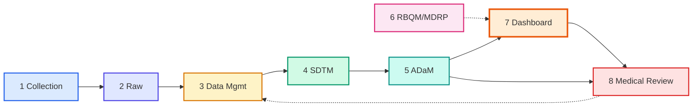
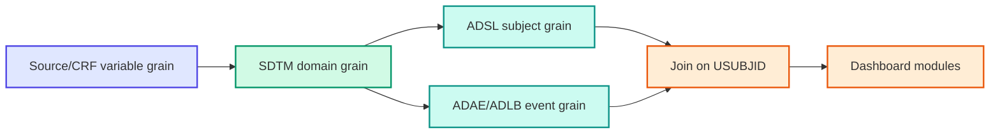
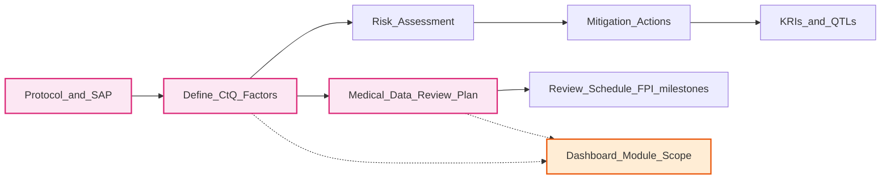

# Clinical Trial Data Pipeline: From Collection to Medical Review

**CDISCPILOT01 — Reference Architecture**

| | |
|---|---|
| **Purpose** | Describe the end-to-end clinical trial data pipeline from site collection through standardized datasets, visual analytics, and medical data review. |
| **Audience** | Biometrics, data management, and visual analytics professionals; interview preparation for MDR dashboard roles. |
| **Scope** | Early-phase interventional trials using CDISC standards, RBQM principles, and interactive Shiny dashboards replicating teal.modules.clinical safety outputs. Excludes submission packaging (eCTD) and post-marketing surveillance. |

## Executive Summary

Clinical trial data progresses through a sequenced pipeline: collection at sites and vendors, management and cleaning in electronic data capture (EDC) systems, standardization to Study Data Tabulation Model (SDTM) domains, programming of Analysis Data Model (ADaM) datasets with independent quality control (QC), and consumption by visual analytics platforms that support Medical Data Review (MDR). In parallel, Risk-Based Quality Management (RBQM) and Medical Data Review Plans (MDRPs) define Critical to Quality (CtQ) factors that determine what each dashboard module must display. The Real-time Visual Analytics Specialist operates primarily at the interface between ADaM outputs and MDR workflows, delivering standardized, traceable, interactive tools aligned to predefined safety and quality milestones.

---

## 1.0 Pipeline Overview

### 1.1 Figure 1 — Executive Pipeline

*Figure 1. Eight-stage clinical trial data pipeline from collection through medical review. Solid arrows denote primary data flow; dashed arrows denote planning inputs and feedback loops.*

**Legend — Stage Colors**

| Stage | Color | Description |
|-------|-------|-------------|
| 1 Collection | Blue | Site and vendor data acquisition |
| 2 Raw / Source | Indigo | Unstandardized extracts and source records |
| 3 Data Management | Amber | Cleaning, queries, coding, database locks |
| 4 SDTM | Green | CDISC tabulation datasets for submission |
| 5 ADaM + QC | Teal | Analysis-ready datasets and validation |
| 6 RBQM / MDRP | Pink | Parallel quality and review planning |
| 7 Dashboard | Orange | Interactive visual analytics (primary role) |
| 8 Medical Review | Red | Clinical review, signal detection, actions |

**Line conventions:** Solid arrows = primary data flow. Dashed arrows = planning inputs (Stage 6 → 7) and feedback loops (Stage 8 → 3 via data queries).

### 1.2 Figure 2 — Detailed Pipeline

*Figure 2. Detailed left-to-right pipeline with internal processes per stage. Stage 7 (Visual Analytics) is highlighted to indicate the primary scope of the Real-time Visual Analytics Specialist.*

```mermaid
flowchart LR
  subgraph s1 ["1 Collection"]
    direction TB
    Sites[Clinical_Sites]
    EDC[eCRF_EDC_System]
    Vendors[Central_Lab_PK_Vendors]
  end

  subgraph s2 ["2 Raw and Source"]
    direction TB
    Source[Source_Documents]
    RawFeeds[Raw_External_Feeds]
    EDCExtract[EDC_Extracts]
  end

  subgraph s3 ["3 Data Management"]
    direction TB
    Clean[Cleaning_and_Queries]
    Code[MedDRA_Coding]
    Lock[Database_Lock_Cuts]
  end

  subgraph s4 ["4 SDTM Standardization"]
    direction TB
    SDTM[SDTM_Datasets]
    Define[Define_XML_Specs]
  end

  subgraph s5 ["5 ADaM and QC"]
    direction TB
    ADaM[ADSL_ADAE_ADLB]
    TLF[Tables_Listings_Figures]
    QC[Independent_QC]
  end

  subgraph s6 ["6 Quality Plans"]
    direction TB
    RBQM[RBQM_CtQ_Factors]
    MDRP[Medical_Data_Review_Plan]
  end

  subgraph s7 ["7 Visual Analytics"]
    direction TB
    Template[Standard_Template]
    Prep[R_Prep_Logic]
    App[Shiny_Teal_Dashboard]
    UAT[UAT_and_Release]
  end

  subgraph s8 ["8 Medical Review"]
    direction TB
    MDR[Medical_Data_Review]
    Signals[Safety_Signal_Detection]
    Actions[Escalation_and_Actions]
  end

  Sites --> EDC
  Vendors --> RawFeeds
  Sites --> Source
  EDC --> EDCExtract

  EDCExtract --> Clean
  RawFeeds --> Clean
  Source --> Clean
  Clean --> Code --> Lock

  Lock --> SDTM --> Define
  SDTM --> ADaM --> TLF
  ADaM --> QC

  RBQM --> MDRP
  MDRP -.-> Template
  ADaM --> Prep
  Template --> App
  Prep --> App --> UAT

  UAT --> MDR
  TLF --> MDR
  QC --> MDR
  MDR --> Signals --> Actions
  Actions -.-> Clean

  style s1 fill:#DBEAFE,stroke:#2563EB,stroke-width:2px
  style s2 fill:#E0E7FF,stroke:#4F46E5,stroke-width:2px
  style s3 fill:#FEF3C7,stroke:#D97706,stroke-width:2px
  style s4 fill:#D1FAE5,stroke:#059669,stroke-width:2px
  style s5 fill:#CCFBF1,stroke:#0D9488,stroke-width:2px
  style s6 fill:#FCE7F3,stroke:#DB2777,stroke-width:2px
  style s7 fill:#FFEDD5,stroke:#EA580C,stroke-width:4px
  style s8 fill:#FEE2E2,stroke:#DC2626,stroke-width:2px
```

---

## 2.0 Stage Reference

*Table 1. Primary owners, inputs, outputs, and typical storage locations for each pipeline stage.*

| Stage | Primary owner | Key inputs | Key outputs | Typical systems / folders |
|-------|---------------|------------|-------------|-------------------------|
| **1. Collection** | Clinical operations, investigators | Protocol, informed consent | eCRF records, vendor data files | EDC (Medidata, Veeva); site source documents |
| **2. Raw / Source** | Data management | EDC exports, vendor feeds, source docs | Raw extracts, audit trails | `Clinical_Data/Raw/`, `External/`, `Source/` |
| **3. Data Management** | Data management | Raw extracts | Clean data cuts, query resolution logs | EDC; `Clinical_Data/EDC/`; lock snapshots |
| **4. SDTM** | Data standards / SDTM programming | Clean data cuts | SDTM domains (DM, AE, LB, EX), Define-XML | `Clinical_Data/SDTM/`; `spec/define.xml` |
| **5. ADaM + QC** | Statistical programming | SDTM domains, SAP | ADaM datasets (ADSL, ADAE, ADLB), TLFs, QC records | `Clinical_Data/ADaM/`; `Programming/Validation/` |
| **6. RBQM / MDRP** | Clinical quality, medical affairs | Protocol, SAP, CtQ register | MDRP, risk assessments, KRI/QTL definitions | `01_Protocol_and_Plans/RBQM/`; `MDRP/` |
| **7. Visual Analytics** | Real-time Visual Analytics Specialist | ADaM cuts, templates, MDRP | Shiny/teal dashboards, UAT records, release notes | `Visual_Analytics/`; Git repository |
| **8. Medical Review** | Clinical scientists, medical monitors | Dashboards, TLFs, KRIs | Review minutes, signal assessments, action logs | `05_Medical_Review/` |

---

## 3.0 Data Lineage

### 3.1 Grain Transitions

Data granularity changes at each transformation layer. Visual analytics applications consume analysis-ready datasets at subject and event grain, anchored on `USUBJID`.

### 3.2 CDISC Dataset Mapping

*Table 2. Common SDTM-to-ADaM mapping for safety and demographics domains used in MDR dashboards.*

| SDTM domain | SDTM purpose | ADaM dataset | ADaM purpose | Key join variable |
|-------------|--------------|--------------|--------------|-----------------|
| DM | Demographics | ADSL | Subject-level analysis anchor | `USUBJID` |
| AE | Adverse events | ADAE | Treatment-emergent safety events | `USUBJID` |
| LB | Laboratory results | ADLB | Lab values, shifts, abnormality flags | `USUBJID` |
| EX | Exposure | ADEX | Dosing and exposure over time | `USUBJID` |
| VS | Vital signs | ADVS | Vitals trends and change from baseline | `USUBJID` |

**Rule:** All event-level datasets (`ADAE`, `ADLB`, `ADEX`) join to `ADSL` via `USUBJID`. Population flags (`SAFFL`, `ITTFL`) reside in `ADSL` and filter all downstream modules.

---

## 4.0 Parallel Quality Track

RBQM and the MDRP operate in parallel with data programming (Stage 6 in Figure 1). They do not transform data; they define **what must be reviewed** and **when**.

Each dashboard module must trace to at least one CtQ factor and one MDRP review section. See [methods_cheatsheet.md](methods_cheatsheet.md) for RBQM terminology.

---

## 5.0 Medical Data Review Subprocess

Stage 8 decomposes into a repeatable review cycle supported by interactive dashboards and static TLFs.

### 5.1 Figure 3 — MDR Review Subprocess

*Figure 3. Medical Data Review subprocess. Reviewers progress from population scoping through signal detection to patient-level investigation and documented outcomes.*

```mermaid
flowchart LR
  Inputs["Dashboards TLFs KRIs"] --> Filter["Filter analysis population"]
  Filter --> PopView["Population safety view"]
  PopView --> Signal["Signal detection"]
  Signal --> Drill["Patient drill-down"]
  Drill --> Discuss["Clinical discussion"]
  Discuss --> Document["Document findings"]
  Discuss --> Escalate["Escalate if required"]
  Escalate --> Query["Raise data queries"]
  Escalate --> PlanUpdate["Update review plan"]
  Query -.-> DM["Data Management Stage 3"]

  style Inputs fill:#FEE2E2,stroke:#DC2626,stroke-width:2px
  style Filter fill:#FEE2E2,stroke:#DC2626,stroke-width:2px
  style PopView fill:#FEE2E2,stroke:#DC2626,stroke-width:2px
  style Signal fill:#FEE2E2,stroke:#DC2626,stroke-width:2px
  style Drill fill:#FEE2E2,stroke:#DC2626,stroke-width:2px
  style Discuss fill:#FEE2E2,stroke:#DC2626,stroke-width:2px
  style Document fill:#FEF3C7,stroke:#D97706,stroke-width:2px
  style Escalate fill:#FEF3C7,stroke:#D97706,stroke-width:2px
  style DM fill:#FEF3C7,stroke:#D97706,stroke-width:2px
```

**Distinction:** MDR is clinician-led review of trial data for safety and efficacy signals. Source Data Verification (SDV) is comparison of eCRF entries against source documents. Under RBQM, both are risk-proportionate and complementary.

---

## 6.0 Role of Visual Analytics

The Real-time Visual Analytics Specialist delivers Stage 7. The role consumes ADaM outputs (Stage 5), implements modules scoped by the MDRP (Stage 6), and supports the MDR subprocess (Stage 8).

### 6.1 Mapping to This Repository

*Table 3. Pipeline Stage 7 components mapped to repository paths (CDISCPILOT01).*

| Pipeline component | Repository path | Description |
|--------------------|-----------------|-------------|
| ADaM inputs | `data/adam/` | ADSL, ADAE, ADLB, ADEX, ADVS, ADCM, ADMH, ADTTE (`.rds`) from `pharmaverseadam` |
| Data build | `programs/01_prepare_adam.R` | Load and save CDISCPILOT01 ADaM domains |
| ADTTE derivation | `programs/02_derive_adtte.R` | Time-to-first dermatologic event |
| Data verification | `programs/00_verify_adam.R` | STUDYID, row counts, safety-pop overlap |
| Analysis helpers | `R/*.R` | TEAE, labs, exposure, vitals, CM, KM, patient profile |
| Visual standards | `R/theme_clinical.R` | Consistent plot styling |
| Dashboard | `app.R` | Raw Shiny MDR app (teal-equivalent module scope) |
| Configuration | `config/study_config.yml` | Study metadata, S1–S13 section mapping |
| Environment | `renv.lock` | Reproducible package management |

### 6.2 CtQ-to-Module Mapping

*Table 4. Dashboard modules aligned to Critical to Quality factors.*

| Dashboard module | ADaM input | CtQ factor | MDR purpose |
|------------------|------------|------------|-------------|
| Demographics / disposition / exposure | ADSL, ADEX | Analysis population integrity | Confirm correct review set and exposure |
| Adverse event tables (AET01–AET03) | ADAE | Safety reporting accuracy | Detect treatment-emergent signals |
| Lab trends / shifts / Hy's Law | ADLB | Laboratory monitoring | Identify clinically relevant lab changes |
| Vital signs | ADVS | Safety monitoring | Track vitals over time |
| Concomitant medications | ADCM | Safety reporting accuracy | Review on-treatment concomitant therapy |
| Time-to-event (KM) | ADTTE | Safety (tolerability) | Quantify time to dermatologic events |
| Patient profile | ADSL, ADAE, ADLB, ADVS, ADCM, ADMH | Traceability | Investigate individual subjects |
| Arm filter panel | ADSL flags | Eligibility / population definition | Subset arms while keeping safety pop fixed |

### 6.3 Teal-equivalent analysis catalogue (S1–S13)

*Table 5. FDA ST&F / pharmaverse TLG modules implemented in the raw Shiny dashboard.*

| Section | Tab | teal.modules.clinical analogue | Dataset |
|---------|-----|-------------------------------|---------|
| S1 | Demographics | `tm_t_summary` | ADSL |
| S2 | Demographics | disposition | ADSL |
| S11 | Demographics | `tm_t_exposure` | ADSL + ADEX |
| S3 | AE Overview | `tm_t_events_summary` | ADAE |
| S4 | AE Overview | SAE listing | ADAE |
| S5 | TEAE Table | `tm_t_events` (AET02) | ADAE |
| S5b | TEAE Table | `tm_t_events_by_grade` (AET03) | ADAE |
| S6 | Lab Trends | line plot (AVAL / CHG); all PARAMCD by LBCAT | ADLB |
| S7 | Lab Shifts | `tm_t_shift_by_arm`; params with BNRIND/ANRIND | ADLB |
| S8 | Hy's Law | eDISH | ADLB |
| S12 | Vital Signs | vitals line plot | ADVS |
| S13 | Concomitant Meds | CM module | ADCM |
| S9 | Patient Profile | `tm_t_pp_*` / IPPG01 | ADSL + ADAE + ADLB + ADVS + ADCM + ADMH |
| S10 | Time-to-Event | `tm_g_km` + `tm_t_tte` | ADTTE |

---

## 7.0 Regulatory Context

The pipeline aligns with the following guidance (non-exhaustive):

1. **ICH E6(R2/R3)** — Good Clinical Practice; mandates risk-based quality management systems for sponsors.[^1]
2. **ICH E8(R1)** — General Considerations for Clinical Studies; defines quality-by-design and CtQ factor identification.[^2]
3. **FDA (2013)** — *Guidance for Industry: Oversight of Clinical Investigations — A Risk-Based Approach to Monitoring*.[^3]
4. **EMA (2013)** — *Reflection Paper on Risk Based Quality Management in Clinical Trials*.[^4]

[^1]: International Council for Harmonisation. ICH E6 Good Clinical Practice.
[^2]: International Council for Harmonisation. ICH E8(R1) General Considerations for Clinical Studies.
[^3]: U.S. Food and Drug Administration. Risk-Based Approach to Monitoring (2013).
[^4]: European Medicines Agency. RBQM Reflection Paper (2013).

---

## 8.0 Interview Talking Points

1. **Pipeline position:** "My work sits at Stage 7 — I build interactive dashboards on validated ADaM data that medical reviewers use during ongoing MDR, typically live by First Patient In."

2. **Data boundary:** "Dashboards read ADaM, not raw CRF or SDTM. Raw data stays in EDC and controlled external folders; SDTM and ADaM programming happen upstream with independent QC."

3. **Quality alignment:** "Each module maps to CtQ factors defined in RBQM and the MDRP — I don't visualize everything; I visualize what matters for safety and decision-making."

4. **MDR workflow:** "Reviewers work in the safety population, optionally filter arms, scan TEAE incidence (including AET03 severity), exposure, labs, vitals, and con meds at population level, then drill to patient profiles with medical history. The sidebar filter keeps all modules on the same arm subset."

5. **Traceability:** "Templates are version-controlled in Git with renv for reproducibility. Data prep is separated from the app layer so QC can target each component independently."

For demo script and Q&A, see [interview_guide.md](interview_guide.md). For role context, see [context_file.md](context_file.md).

---

## Related Documents

| Document | Purpose |
|----------|---------|
| [ideal_architecture.md](ideal_architecture.md) | Three-layer app architecture, data contracts, cut refresh, and deployment guide |
| [interview_guide.md](interview_guide.md) | Demo script and likely interview questions |
| [methods_cheatsheet.md](methods_cheatsheet.md) | RBQM, CDISC, and MDR terminology |
| [context_file.md](context_file.md) | Target job description and role requirements |

---

*Document version: 2.0 — CDISCPILOT01 teal-equivalent MDR dashboard*
